# vello_hybrid 从新手到高手完全指南

> 基于 vello_hybrid 0.2.0 | 系统化学习路径 | 含完整流程图与可运行代码

---

## 📚 学习路径总览

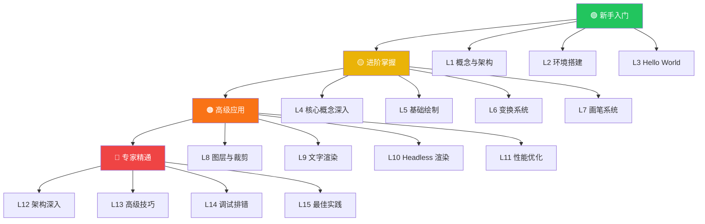

| 阶段 | 等级 | 目标 | 预计时间 |
|------|------|------|----------|
| 🟢 新手 | L1-L3 | 理解概念，跑通第一个程序 | 1-2 天 |
| 🟡 进阶 | L4-L7 | 掌握绘制、变换、画笔核心 API | 3-5 天 |
| 🟠 高级 | L8-L11 | 图层、文字、离屏渲染、性能 | 1-2 周 |
| 🔴 专家 | L12-L15 | 架构原理、高级技巧、工程化 | 持续精进 |

---

# 🟢 第一阶段：新手入门

## L1：vello_hybrid 是什么

### 1.1 定位与起源

vello_hybrid 是 **linebender** 组织 Vello 项目的三大渲染后端之一，采用 **CPU 路径处理 + GPU 合成** 的混合架构。

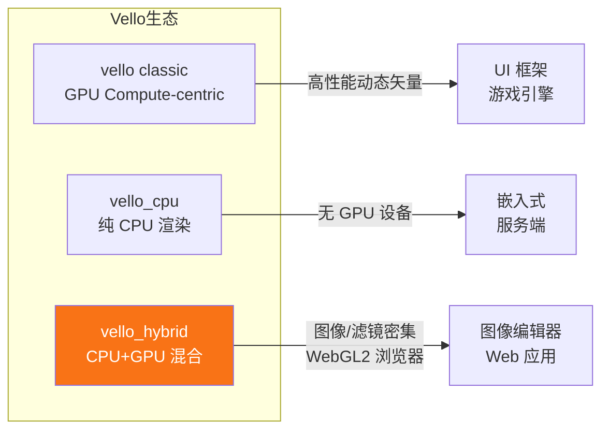

### 1.2 混合架构原理

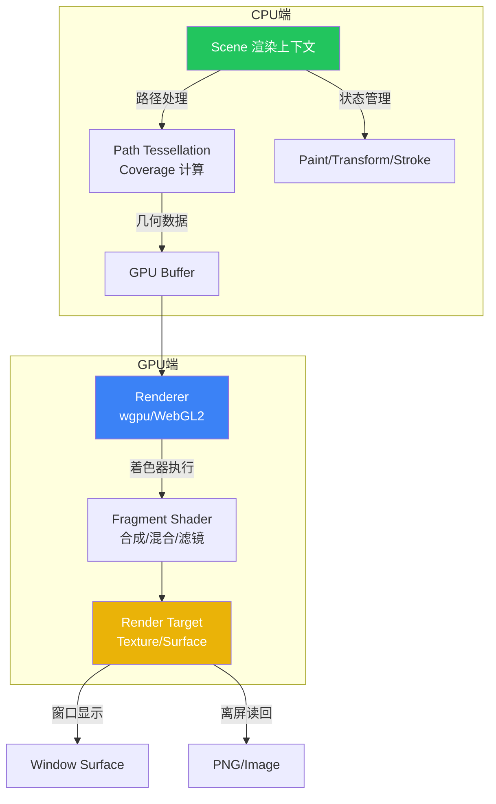

**核心思想**：
- **CPU** 负责路径 tessellation、coverage 计算、初始几何构建
- **GPU** 负责快速渲染、合成、混合、滤镜
- 最小化 CPU↔GPU 数据传输（一次性上传几何，GPU 反复使用）

### 1.3 适用场景与不适用场景

| ✅ 适合 | ❌ 不适合 |
|---------|-----------|
| 图像编辑器（图层、滤镜、混合） | 超大规模实时矢量地图（>10万路径） |
| Web 应用（WebGL2 后端，兼容性好） | 需要精确 CPU 像素控制的场景 |
| 设计工具（渐变、文字、矢量绘制） | 无 GPU 且无法使用软件渲染的极端环境 |
| 数据可视化（图表、信息图） | 对延迟极度敏感的游戏场景（用 vello classic） |
| PDF/SVG 渲染（静态或半静态） | |

---

## L2：环境搭建

### 2.1 前置要求

```mermaid
graph TD
    R[Rust 工具链<br/>edition 2024+] --> OK{环境检查}
    GPU[GPU 驱动<br/>Vulkan/Metal/DX12] --> OK
    OK -->|✅ 通过| START[开始开发]
    OK -->|❌ 缺少 Rust| INSTALL_RUST[安装 rustup<br/>curl --proto '=https' --tlsv1.2 -sSf https://sh.rustup.rs | sh]
    OK -->|❌ 无 GPU| FALLBACK[使用 force_fallback_adapter<br/>软件渲染]

    style START fill:#22c55e,color:#fff
    style FALLBACK fill:#eab308,color:#fff
```

### 2.2 创建项目与依赖配置

```bash
cargo new vello_hybrid_demo
cd vello_hybrid_demo
```

**Cargo.toml 关键依赖**：

```toml
[dependencies]
vello_hybrid = "0.2.0"
kurbo = "0.13"          # 2D 几何（BezPath, Affine, Stroke）
peniko = "0.6"          # 画笔/颜色/字体数据
wgpu = "29.0"           # GPU 抽象层
vello_common = "0.2"    # 共享类型（Filter 等）
glifo = "0.3"            # 字形渲染（Glyph, FontEmbolden）

[dev-dependencies]
pollster = "0.3"         # 阻塞式 async（wgpu 初始化）
image = { version = "0.25", default-features = false, features = ["png"] }
skrifa = "0.44"          # 字体解析
smallvec = "1.13"        # dash_pattern 用
```

> **重要**：vello_hybrid 0.2.0 **未重新导出** kurbo / peniko / wgpu，必须显式添加这些依赖。

### 2.3 Feature Flags 说明

| Feature | 默认 | 说明 |
|---------|------|------|
| `wgpu` | ✅ | 启用 wgpu GPU 后端 |
| `wgpu_default` | ✅ | wgpu 默认硬件后端 |
| `text` | ✅ | 启用字形渲染 `Scene::glyph_run` |
| `webgl` | ❌ | 启用 WebGL2 后端（浏览器/WASM） |

---

## L3：Hello World —— 第一个渲染程序

### 3.1 最小可运行示例

```rust
use vello_hybrid::{Scene, Renderer, RenderTargetConfig, RenderSize, TextureBindings};
use wgpu;
use kurbo::Rect;
use peniko::Color;

fn main() -> Result<(), String> {
    // 1. 初始化 wgpu
    let instance = wgpu::Instance::default();
    let adapter = pollster::block_on(instance.request_adapter(
        &wgpu::RequestAdapterOptions::default(),
    ))?;
    let (device, queue) = pollster::block_on(adapter.request_device(
        &wgpu::DeviceDescriptor {
            label: Some("hello-device"),
            required_features: wgpu::Features::empty(),
            required_limits: wgpu::Limits::default(),
            memory_hints: wgpu::MemoryHints::default(),
            trace: wgpu::Trace::Off,
            experimental_features: wgpu::ExperimentalFeatures::default(),
        },
    ))?;

    // 2. 创建渲染纹理
    let (width, height) = (400u32, 300u32);
    let texture = device.create_texture(&wgpu::TextureDescriptor {
        label: Some("render-target"),
        size: wgpu::Extent3d { width, height, depth_or_array_layers: 1 },
        mip_level_count: 1,
        sample_count: 1,
        dimension: wgpu::TextureDimension::D2,
        format: wgpu::TextureFormat::Rgba8Unorm,
        usage: wgpu::TextureUsages::RENDER_ATTACHMENT | wgpu::TextureUsages::COPY_SRC,
        view_formats: &[],
    });
    let view = texture.create_view(&wgpu::TextureViewDescriptor::default());

    // 3. 创建 Renderer + Resources
    let config = RenderTargetConfig {
        format: wgpu::TextureFormat::Rgba8Unorm,
        width,
        height,
    };
    let (mut renderer, mut resources) = Renderer::new(&device, &config);

    // 4. 构建 Scene —— 画一个红色矩形
    let mut scene = Scene::new(width as u16, height as u16);
    scene.set_paint(Color::from_rgb8(220, 60, 60));
    scene.fill_rect(&Rect::new(50.0, 50.0, 350.0, 250.0));

    // 5. 编码并提交渲染命令
    let mut encoder = device.create_command_encoder(&wgpu::CommandEncoderDescriptor::default());
    renderer.render(
        &scene,
        &mut resources,
        &device,
        &queue,
        &mut encoder,
        &RenderSize { width, height },
        &view,
        &TextureBindings::default(),
    )?;
    queue.submit(Some(encoder.finish()));

    println!("Hello vello_hybrid! 渲染完成。");
    Ok(())
}
```

### 3.2 渲染流程全景图

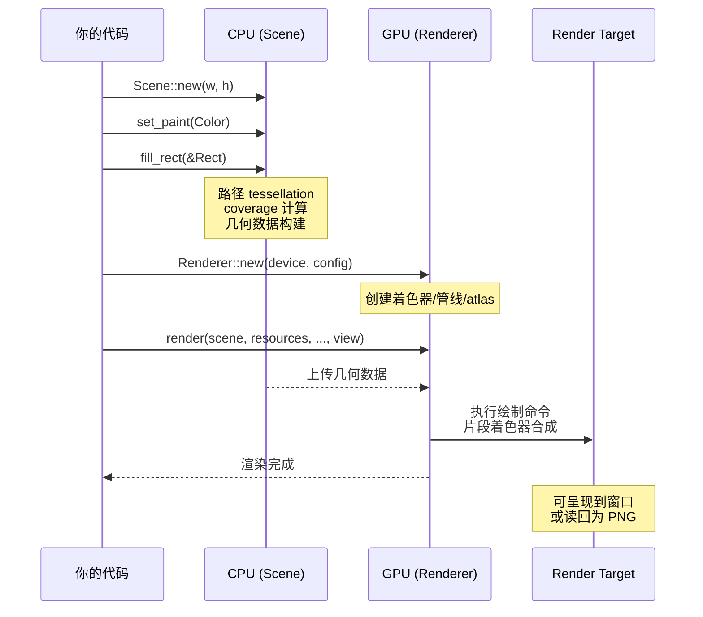

### 3.3 运行验证

```bash
cargo run
# 输出: Hello vello_hybrid! 渲染完成。
```

> 🎉 恭喜！你已经完成了新手阶段。接下来进入进阶阶段，掌握核心 API。

---

# 🟡 第二阶段：进阶掌握

## L4：核心概念深入

### 4.1 五大核心类型关系

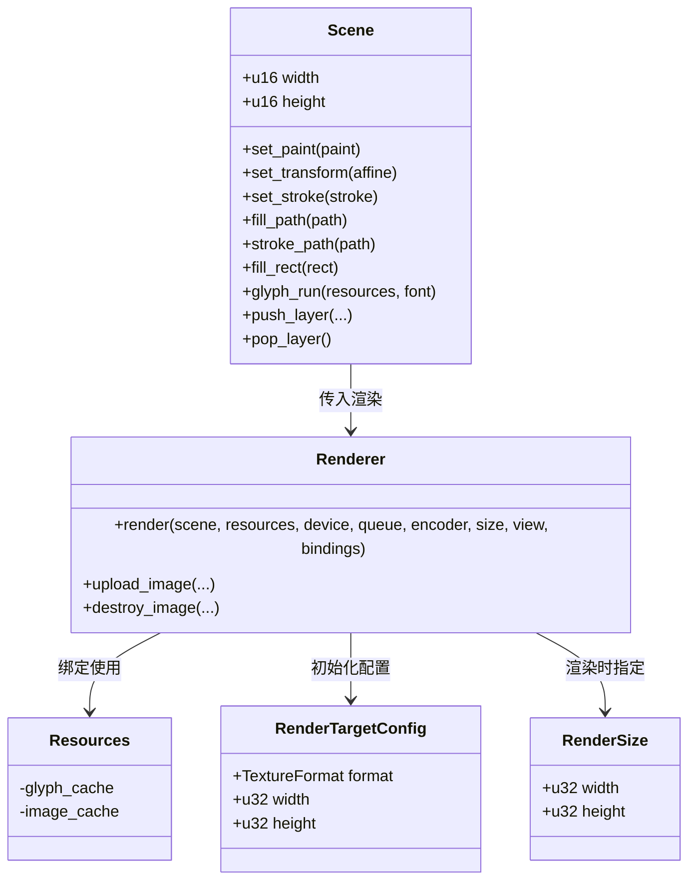

### 4.2 Scene 状态机

Scene 内部维护一个状态栈，绘制操作使用当前状态。

```mermaid
stateDiagram-v2
    [*] --> DefaultState: Scene::new()

    DefaultState --> ModifiedState: set_paint()
    DefaultState --> ModifiedState: set_transform()
    DefaultState --> ModifiedState: set_stroke()
    DefaultState --> ModifiedState: set_fill_rule()

    ModifiedState --> Drawing: fill_path()
    ModifiedState --> Drawing: stroke_path()
    ModifiedState --> Drawing: fill_rect()

    Drawing --> ModifiedState: 继续设置状态
    Drawing --> Drawing: 继续绘制

    ModifiedState --> SavedState: save_current_state()
    SavedState --> ModifiedState: restore_state()

    ModifiedState --> LayerPushed: push_layer()
    LayerPushed --> ModifiedState: 图层内绘制
    ModifiedState --> LayerPopped: pop_layer()

    LayerPopped --> [*]: 渲染完成
```

**关键规则**：
- `set_transform` 是**设置**而非累积，每次调用替换当前矩阵
- `save_current_state` / `restore_state` 可保存恢复完整状态
- 图层（layer）创建独立的状态空间，pop 后恢复外层状态

### 4.3 坐标系统

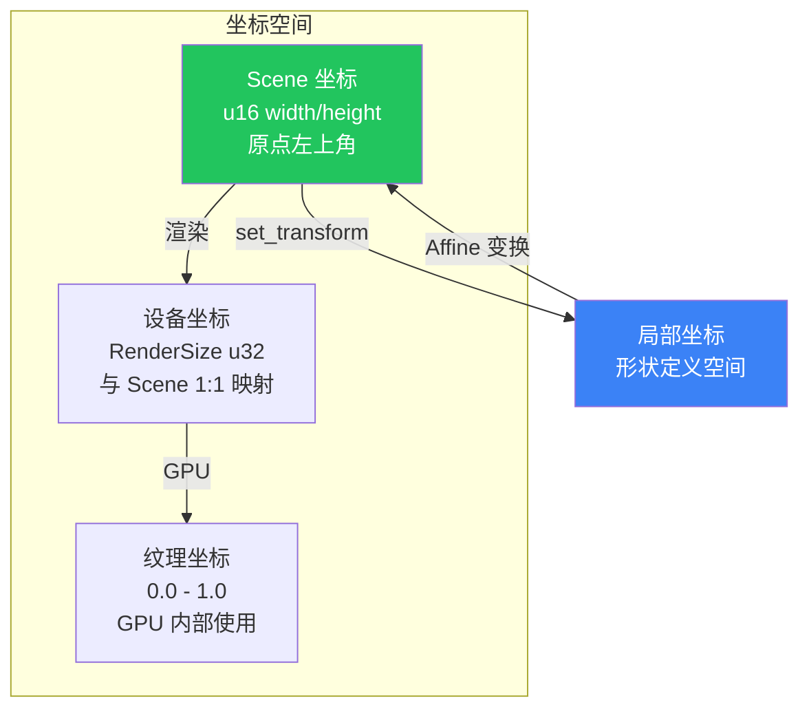

- **Scene 坐标**：原点在左上角，x 向右，y 向下，单位为像素
- **局部坐标**：定义形状时使用的坐标，经 `set_transform` 变换后映射到 Scene 坐标
- **Scene 宽高为 u16**（最大 65535），RenderSize 为 u32

---

## L5：基础绘制

### 5.1 绘制操作分类

```mermaid
graph TD
    DRAW[绘制操作] --> FILL[填充]
    DRAW --> STROKE[描边]

    FILL --> FILL_PATH[fill_path(&BezPath)]
    FILL --> FILL_RECT[fill_rect(&Rect)]

    STROKE --> STROKE_PATH[stroke_path(&BezPath)]
    STROKE --> STROKE_RECT[stroke_rect(&Rect)]

    FILL_PATH --> SHAPES[kurbo 形状]
    STROKE_PATH --> SHAPES

    SHAPES --> CIRCLE[Circle.to_path()]
    SHAPES --> RRECT[RoundedRect.to_path()]
    SHAPES --> ELLIPSE[Ellipse.to_path()]
    SHAPES --> CUSTOM[BezPath 手动构建]

    style FILL fill:#22c55e,color:#fff
    style STROKE fill:#3b82f6,color:#fff
```

### 5.2 基础形状代码

```rust
use vello_hybrid::Scene;
use kurbo::{Rect, Shape, Stroke};
use peniko::{Color, Fill};

let mut scene = Scene::new(800, 600);

// 红色填充矩形
scene.set_paint(Color::from_rgb8(220, 60, 60));
scene.set_fill_rule(Fill::NonZero);
scene.fill_rect(&Rect::new(50.0, 50.0, 250.0, 200.0));

// 蓝色填充圆形（需 .to_path() 转换）
scene.set_paint(Color::from_rgb8(60, 100, 220));
let circle = kurbo::Circle::new((400.0, 130.0), 80.0).to_path(0.01);
scene.fill_path(&circle);

// 绿色描边圆角矩形
scene.set_paint(Color::from_rgb8(40, 180, 90));
scene.set_stroke(Stroke::new(6.0));
let rrect = kurbo::RoundedRect::new(550.0, 50.0, 750.0, 200.0, 20.0).to_path(0.01);
scene.stroke_path(&rrect);
```

### 5.3 手动构建 BezPath

```rust
use kurbo::BezPath;

// 心形路径
let mut heart = BezPath::new();
heart.move_to((cx, cy - 4.0 * s));
heart.curve_to((cx, cy - 8.0 * s), (cx - 8.0 * s, cy - 8.0 * s), (cx - 8.0 * s, cy - 4.0 * s));
heart.curve_to((cx - 8.0 * s, cy), (cx, cy + 4.0 * s), (cx, cy + 8.0 * s));
heart.curve_to((cx, cy + 4.0 * s), (cx + 8.0 * s, cy), (cx + 8.0 * s, cy - 4.0 * s));
heart.curve_to((cx + 8.0 * s, cy - 8.0 * s), (cx, cy - 8.0 * s), (cx, cy - 4.0 * s));
heart.close_path();
```

**BezPath 命令**：
| 命令 | 作用 |
|------|------|
| `move_to(p)` | 移动到点 p（开始新子路径） |
| `line_to(p)` | 从当前点画直线到 p |
| `quad_to(c, p)` | 二次贝塞尔曲线（控制点 c，终点 p） |
| `curve_to(c1, c2, p)` | 三次贝塞尔曲线（控制点 c1/c2，终点 p） |
| `close_path()` | 闭合当前子路径 |

### 5.4 填充规则

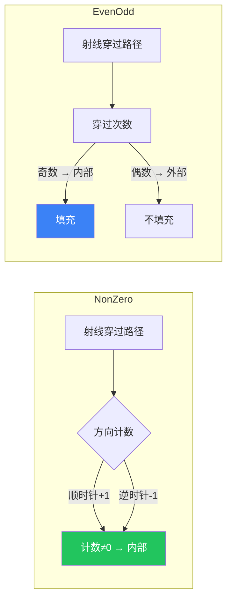

```rust
use peniko::Fill;
scene.set_fill_rule(Fill::NonZero);  // 默认，非零环绕
scene.set_fill_rule(Fill::EvenOdd);  // 奇偶规则
```

---

## L6：变换系统

### 6.1 变换类型全景

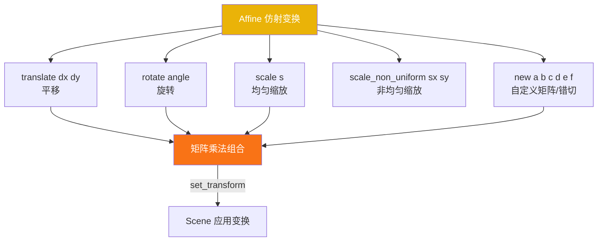

### 6.2 基本变换代码

```rust
use kurbo::Affine;

// 平移
let t = Affine::translate((100.0, 50.0));

// 旋转（弧度）
let r = Affine::rotate(std::f64::consts::PI / 6.0); // 30度

// 均匀缩放
let s = Affine::scale(1.5);

// 非均匀缩放
let sn = Affine::scale_non_uniform(2.0, 0.5);

// 水平错切（自定义矩阵 [a, b, c, d, e, f]）
let skew = Affine::new([1.0, 0.0, 0.3, 1.0, 0.0, 0.0]);
```

### 6.3 绕指定中心旋转

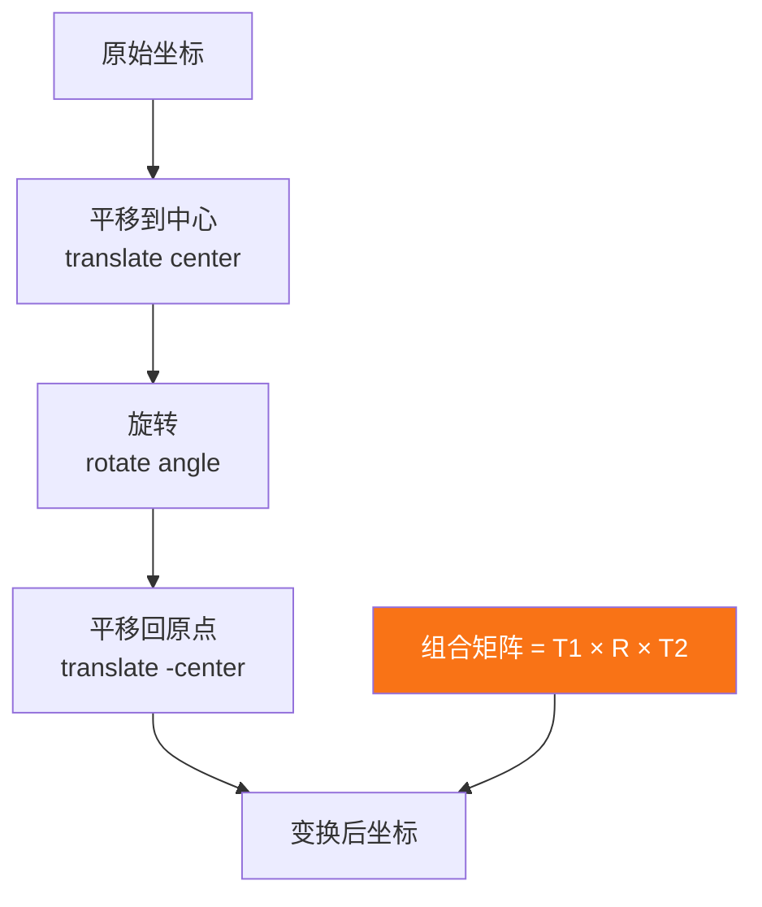

```rust
let center = (300.0, 200.0);
let rotate_30 = Affine::translate(center)
    * Affine::rotate(std::f64::consts::PI / 6.0)
    * Affine::translate((-center.0, -center.1));

scene.set_transform(rotate_30);
scene.fill_rect(&Rect::new(250.0, 150.0, 350.0, 250.0));
scene.reset_transform(); // 恢复单位矩阵
```

### 6.4 变换组合顺序

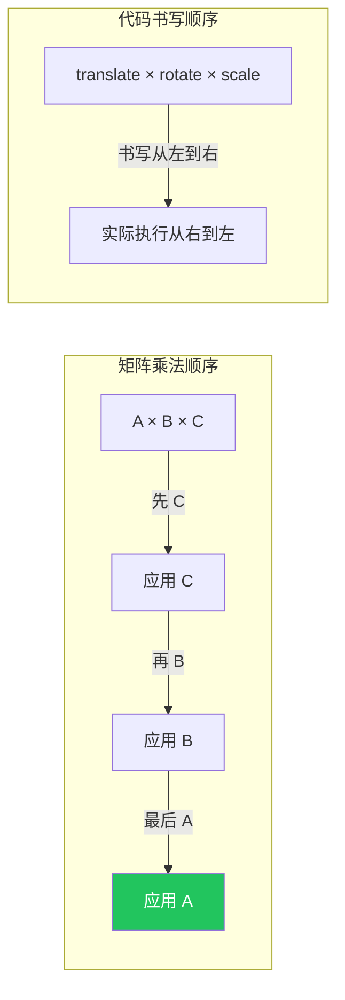

> **关键**：`A * B * C` 的执行顺序是 **先 C，再 B，最后 A**。代码书写顺序与实际执行顺序相反。

### 6.5 变换使用模式

```rust
// 模式1：单次变换后重置
scene.set_transform(Affine::translate((100.0, 100.0)));
scene.fill_rect(&rect);
scene.reset_transform();

// 模式2：保存/恢复状态
scene.save_current_state();
scene.set_transform(Affine::rotate(0.5));
scene.fill_path(&path);
scene.restore_state(); // 恢复到 save 时的状态

// 模式3：手动组合嵌套变换
let nested = Affine::translate((x, y))
    * Affine::rotate(angle)
    * Affine::scale(s);
scene.set_transform(nested);
```

---

## L7：画笔系统

### 7.1 PaintType 三种变体

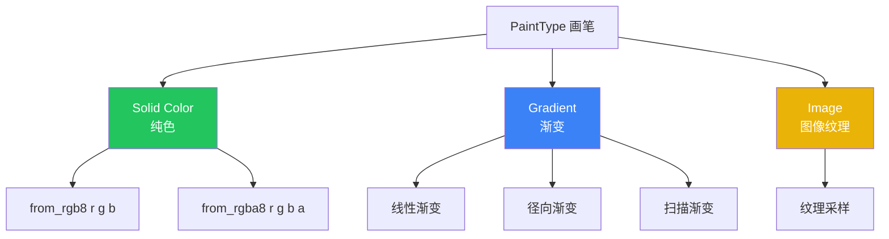

### 7.2 纯色与透明度

```rust
use peniko::Color;

// 不透明
scene.set_paint(Color::from_rgb8(220, 60, 60));

// 半透明（alpha 0-255）
scene.set_paint(Color::from_rgba8(220, 60, 60, 128)); // 50% 透明
```

**透明度叠加效果**：
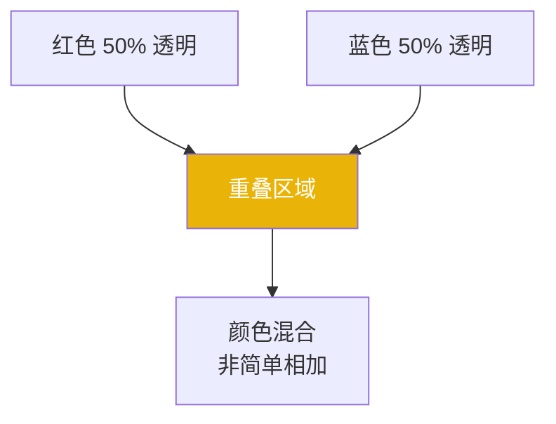

### 7.3 描边样式

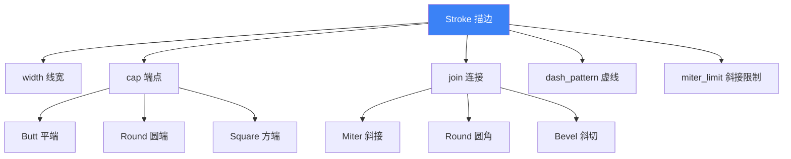

```rust
use kurbo::{Stroke, Cap, Join};

// 基础描边
scene.set_stroke(Stroke::new(4.0));

// 圆端 + 圆角连接
scene.set_stroke(Stroke::new(6.0).with_caps(Cap::Round).with_join(Join::Round));

// 虚线（使用 smallvec）
let mut dash = Stroke::new(3.0);
dash.dash_pattern = smallvec::smallvec![10.0, 5.0]; // 10px 实 + 5px 空
dash.dash_offset = 0.0;
scene.set_stroke(dash);
```

### 7.4 填充+描边组合

```rust
// 先填充，再描边（描边在填充之上）
scene.set_paint(Color::from_rgb8(255, 220, 100));
scene.fill_path(&shape);

scene.set_paint(Color::from_rgb8(180, 120, 20));
scene.set_stroke(Stroke::new(4.0));
scene.stroke_path(&shape);
```

---

# 🟠 第三阶段：高级应用

## L8：图层与裁剪

### 8.1 图层系统全景

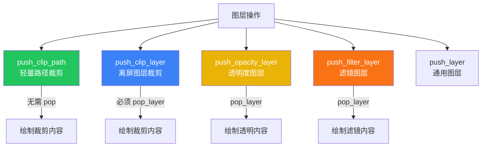

### 8.2 路径裁剪 vs 图层裁剪

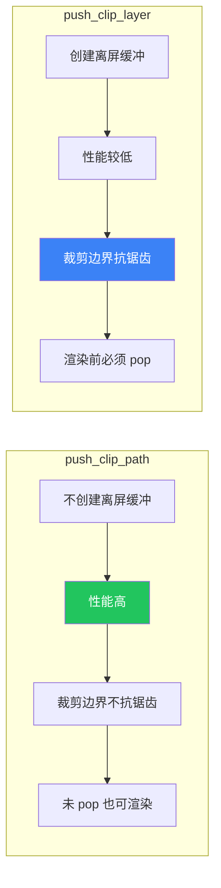

```rust
// 轻量路径裁剪
let clip_circle = kurbo::Circle::new((120.0, 120.0), 90.0).to_path(0.01);
scene.push_clip_path(&clip_circle);
// ... 绘制内容（被裁剪在圆内）...
scene.pop_clip_path();

// 离屏图层裁剪（抗锯齿边界）
let clip_rrect = kurbo::RoundedRect::new(260.0, 40.0, 460.0, 200.0, 30.0).to_path(0.01);
scene.push_clip_layer(&clip_rrect);
// ... 绘制内容...
scene.pop_layer(); // 注意：是 pop_layer 不是 pop_clip_layer
```

### 8.3 透明度图层

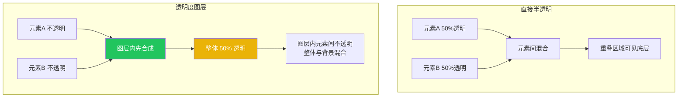

```rust
scene.push_opacity_layer(0.5); // 整体 50% 透明
scene.set_paint(Color::from_rgb8(220, 60, 60));
scene.fill_path(&circle1); // 图层内不透明
scene.set_paint(Color::from_rgb8(60, 100, 220));
scene.fill_path(&circle2); // 与 circle1 重叠处不透明
scene.pop_layer();
```

### 8.4 滤镜图层

```rust
use vello_common::filter_effects::{Filter, FilterFunction};

// 高斯模糊（radius = 标准差 σ）
scene.push_filter_layer(Filter::from_function(FilterFunction::Blur {
    radius: 8.0,
}));
scene.fill_rect(&rect);
scene.pop_layer();
```

> **注意**：vello_hybrid 0.2.0 仅支持简单的 `FilterFunction::Blur`，复杂滤镜图（filter graph）尚未支持。

### 8.5 图层组合使用

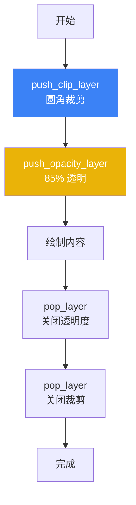

```rust
scene.push_clip_layer(&clip_shape);
scene.push_opacity_layer(0.85);
// 绘制内容...
scene.pop_layer(); // 关闭透明度
scene.pop_layer(); // 关闭裁剪
```

---

## L9：文字渲染

### 9.1 文字渲染流程

```mermaid
graph TD
    FONT[字体文件 bytes] --> FONTDATA[FontData::new<br/>Blob + index]
    FONTDATA --> GLYPH_RUN[scene.glyph_run<br/>(resources, font)]

    GLYPH_RUN --> BUILDER[GlyphRunBuilder]
    BUILDER --> FONT_SIZE[font_size px]
    BUILDER --> EMBOLDEN[font_embolden<br/>合成粗体]
    BUILDER --> GLYPH_TRANSFORM[glyph_transform<br/>字形变换/斜体]
    BUILDER --> FILL[fill_glyphs<br/>填充文字]
    BUILDER --> STROKE[stroke_glyphs<br/>描边文字]

    FILL --> RENDER[渲染到 Scene]
    STROKE --> RENDER

    style GLYPH_RUN fill:#f97316,color:#fff
    style BUILDER fill:#3b82f6,color:#fff
```

### 9.2 关键注意事项

```mermaid
graph LR
    subgraph 文字渲染特殊流程
        A[创建 Renderer+Resources] --> B[构建 Scene]
        B --> C[glyph_run 传入 &mut resources]
        C --> D[渲染]
    end

    NOTE[为什么需要 Resources?<br/>字形缓存 atlas 存储在 Resources 中]

    style A fill:#22c55e,color:#fff
    style C fill:#eab308,color:#fff
```

> **重要**：文字渲染必须先创建 `Renderer`/`Resources`，再构建 `Scene`（因为 `glyph_run` 需要 `&mut resources`）。

### 9.3 基本文字渲染

```rust
use vello_hybrid::Scene;
use peniko::{Blob, Color, FontData};
use glifo::Glyph;
use kurbo::Rect;

// 1. 加载字体
let font_bytes = std::fs::read("/System/Library/Fonts/Helvetica.ttc")?;
let font_data = FontData::new(Blob::new(std::sync::Arc::new(font_bytes)), 0);

// 2. 先创建 Renderer + Resources
let (device, queue) = common::init_wgpu()?;
let (mut renderer, mut resources) = common::create_renderer(&device, width, height);

// 3. 构建 Scene
let mut scene = Scene::new(width, height);

// 手动构建字形列表（简化布局）
let glyphs = vec![
    Glyph { id: 36, x: 0.0, y: 0.0 },   // 'H'
    Glyph { id: 69, x: 24.0, y: 0.0 },  // 'e'
    Glyph { id: 76, x: 48.0, y: 0.0 },  // 'l'
    Glyph { id: 76, x: 60.0, y: 0.0 },  // 'l'
    Glyph { id: 79, x: 72.0, y: 0.0 },  // 'o'
];

scene.set_paint(Color::from_rgb8(40, 40, 40));
scene
    .glyph_run(&mut resources, &font_data)
    .font_size(32.0)
    .fill_glyphs(glyphs.iter().cloned());
```

### 9.4 合成粗体与斜体

```rust
use glifo::FontEmbolden;
use kurbo::{Affine, Diagonal2};

// 合成粗体
scene
    .glyph_run(&mut resources, &font_data)
    .font_size(36.0)
    .font_embolden(FontEmbolden::new(Diagonal2::new(0.5, 0.0)))
    .fill_glyphs(glyphs.iter().cloned());

// 合成斜体（水平错切）
scene
    .glyph_run(&mut resources, &font_data)
    .font_size(32.0)
    .glyph_transform(Affine::new([1.0, 0.0, -0.3, 1.0, 0.0, 0.0]))
    .fill_glyphs(glyphs.iter().cloned());
```

### 9.5 描边文字

```rust
use kurbo::Stroke;

// 先填充浅色
scene.set_paint(Color::from_rgb8(240, 240, 255));
scene.glyph_run(&mut resources, &font_data)
    .font_size(40.0)
    .fill_glyphs(glyphs.iter().cloned());

// 再描边深色
scene.set_paint(Color::from_rgb8(40, 40, 120));
scene.set_stroke(Stroke::new(2.0));
scene.glyph_run(&mut resources, &font_data)
    .font_size(40.0)
    .stroke_glyphs(glyphs.iter().cloned());
```

> **生产建议**：使用 [parley](https://crates.io/crates/parley) 等专业文本布局库处理字符→glyph_id 映射、advance width、行布局、双向文本等。

---

## L10：Headless 渲染

### 10.1 Headless 渲染全流程

```mermaid
graph TD
    START[开始] --> INSTANCE[1. 创建 wgpu Instance]
    INSTANCE --> ADAPTER[2. 请求 Adapter]
    ADAPTER --> DEVICE[3. 请求 Device+Queue]
    DEVICE --> TEXTURE[4. 创建离屏 Texture+View]
    TEXTURE --> RENDERER[5. 创建 Renderer+Resources]
    RENDERER --> SCENE[6. 构建 Scene]
    SCENE --> ENCODER[7. 创建 CommandEncoder]
    ENCODER --> RENDER[8. renderer.render]
    RENDER --> BUFFER[9. 创建读回 Buffer]
    BUFFER --> COPY[10. copy_texture_to_buffer]
    COPY --> SUBMIT[11. queue.submit]
    SUBMIT --> MAP[12. map_async + poll]
    MAP --> READ[13. 读取像素数据]
    READ --> SAVE[14. 保存为 PNG]
    SAVE --> END[完成]

    style TEXTURE fill:#3b82f6,color:#fff
    style BUFFER fill:#eab308,color:#fff
    style SAVE fill:#22c55e,color:#fff
```

### 10.2 wgpu 29.0 关键 API

```mermaid
graph LR
    subgraph wgpu 29 新API
        TCTI[TexelCopyTextureInfo<br/>替代 ImageCopyTexture]
        TCBI[TexelCopyBufferInfo<br/>替代 ImageCopyBuffer]
        TCBL[TexelCopyBufferLayout<br/>替代 ImageDataLayout]
        PT[PollType::Wait<br/>替代 Maintain::Wait]
        EF[experimental_features<br/>DeviceDescriptor 必填]
    end

    style TCTI fill:#f97316,color:#fff
    style TCBI fill:#f97316,color:#fff
```

### 10.3 核心代码片段

```rust
// 4. 创建离屏纹理
let texture = device.create_texture(&wgpu::TextureDescriptor {
    label: Some("render-target"),
    size: wgpu::Extent3d { width, height, depth_or_array_layers: 1 },
    mip_level_count: 1,
    sample_count: 1,
    dimension: wgpu::TextureDimension::D2,
    format: wgpu::TextureFormat::Rgba8Unorm,
    usage: wgpu::TextureUsages::RENDER_ATTACHMENT | wgpu::TextureUsages::COPY_SRC,
    view_formats: &[],
});
let view = texture.create_view(&wgpu::TextureViewDescriptor::default());

// 9-10. 读回 Buffer + 拷贝纹理数据
let bytes_per_row = width * 4;
let output_buffer = device.create_buffer(&wgpu::BufferDescriptor {
    label: Some("readback"),
    size: (bytes_per_row * height) as u64,
    usage: wgpu::BufferUsages::MAP_READ | wgpu::BufferUsages::COPY_DST,
    mapped_at_creation: false,
});

encoder.copy_texture_to_buffer(
    wgpu::TexelCopyTextureInfo {
        texture: &texture,
        mip_level: 0,
        origin: wgpu::Origin3d::ZERO,
        aspect: wgpu::TextureAspect::All,
    },
    wgpu::TexelCopyBufferInfo {
        buffer: &output_buffer,
        layout: wgpu::TexelCopyBufferLayout {
            offset: 0,
            bytes_per_row: Some(bytes_per_row),
            rows_per_image: Some(height),
        },
    },
    wgpu::Extent3d { width, height, depth_or_array_layers: 1 },
);

// 11-13. 提交 + 映射 + 读取
queue.submit(Some(encoder.finish()));
let buffer_slice = output_buffer.slice(..);
let (sender, receiver) = std::sync::mpsc::channel();
buffer_slice.map_async(wgpu::MapMode::Read, move |r| { sender.send(r).unwrap(); });
let _ = device.poll(wgpu::PollType::Wait { submission_index: None, timeout: None });
receiver.recv()??;
let data = buffer_slice.get_mapped_range();
let pixel_data: Vec<u8> = data.to_vec();
drop(data);
output_buffer.unmap();

// 14. 保存 PNG
let img = image::RgbaImage::from_raw(width, height, pixel_data).unwrap();
img.save("output.png")?;
```

### 10.4 窗口渲染 vs Headless 渲染

```mermaid
graph TD
    subgraph 窗口渲染
        SURFACE[wgpu Surface<br/>窗口系统集成] --> SWAPCHAIN[Swap Chain]
        SWAPCHAIN --> PRESENT[present 显示]
    end

    subgraph Headless 渲染
        TEXTURE[离屏 Texture] --> READBACK[Buffer 读回]
        READBACK --> PNG[保存 PNG]
        READBACK --> PROCESS[CPU 后处理]
    end

    RENDERER[Renderer] -->|渲染到| SURFACE
    RENDERER -->|渲染到| TEXTURE

    style PRESENT fill:#22c55e,color:#fff
    style PNG fill:#3b82f6,color:#fff
```

---

## L11：性能优化

### 11.1 性能优化决策树

```mermaid
graph TD
    START[性能问题] --> PROFILING{性能分析}
    PROFILING -->|CPU 瓶颈| CPU_OPT[CPU 端优化]
    PROFILING -->|GPU 瓶颈| GPU_OPT[GPU 端优化]
    PROFILING -->|数据传输瓶颈| TRANSFER_OPT[传输优化]

    CPU_OPT --> BATCH[减少 state change<br/>批量相同画笔的绘制]
    CPU_OPT --> CACHE[复用 BezPath<br/>避免重复构建]
    CPU_OPT --> TOLERANCE[增大 to_path tolerance<br/>减少路径顶点]

    GPU_OPT --> LAYER[减少离屏图层数量<br/>合并图层]
    GPU_OPT --> FILTER[减少滤镜使用<br/>模糊半径越大越慢]
    GPU_OPT --> TEXTURE[合理设置纹理尺寸<br/>避免超大渲染目标]

    TRANSFER_OPT --> UPLOAD[减少纹理上传<br/>复用 image cache]
    TRANSFER_OPT --> READBACK[减少读回频率<br/>批量读回]

    style CPU_OPT fill:#22c55e,color:#fff
    style GPU_OPT fill:#3b82f6,color:#fff
    style TRANSFER_OPT fill:#eab308,color:#fff
```

### 11.2 关键优化技巧

| 优化项 | 做法 | 预期收益 |
|--------|------|----------|
| **减少 state change** | 相同画笔的绘制集中在一起，避免频繁 `set_paint` | 10-30% |
| **复用 BezPath** | 静态形状预构建，避免每帧 `to_path()` | 5-15% |
| **减少离屏图层** | 能用 `push_clip_path` 就不用 `push_clip_layer` | 20-50% |
| **控制滤镜半径** | 高斯模糊 radius > 20 会显著增加 GPU 开销 | 视情况 |
| **合理 tolerance** | `to_path(0.5)` 比 `to_path(0.01)` 顶点少 5-10 倍 | 5-20% |
| **复用 Resources** | 跨帧复用同一个 Resources（字形/图像缓存） | 显著 |
| **减少读回** | 避免每帧 `copy_texture_to_buffer`，只在需要时读回 | 显著 |

### 11.3 Resources 复用模式

```mermaid
graph TD
    subgraph 错误做法
        E1[每帧创建 Renderer+Resources] --> E2[字形缓存清空]
        E2 --> E3[每帧重新光栅化字形] --> E4[性能差]
    end

    subgraph 正确做法
        C1[初始化时创建一次 Renderer+Resources] --> C2[跨帧复用]
        C2 --> C3[字形缓存命中] --> C4[性能好]
    end

    style C4 fill:#22c55e,color:#fff
    style E4 fill:#ef4444,color:#fff
```

```rust
// ✅ 正确：初始化一次，跨帧复用
struct RenderContext {
    renderer: Renderer,
    resources: Resources,
    device: Device,
    queue: Queue,
}

impl RenderContext {
    fn new() -> Self { /* 初始化一次 */ }

    fn render_frame(&mut self, scene: &Scene, view: &TextureView) {
        let mut encoder = self.device.create_command_encoder(...);
        self.renderer.render(scene, &mut self.resources, ...).unwrap();
        self.queue.submit(Some(encoder.finish()));
    }
}
```

---

# 🔴 第四阶段：专家精通

## L12：架构深入

### 12.1 CPU/GPU 混合渲染原理

```mermaid
graph TD
    subgraph CPU 端处理
        S[Scene 记录] --> TESS[路径 Tessellation<br/>将曲线转为线段]
        TESS --> COV[Coverage 计算<br/>计算像素覆盖率]
        COV --> STRIP[Strip 生成<br/>生成 GPU 可绘制的 strip]
        STRIP --> UPLOAD[一次性上传到 GPU Buffer]
    end

    subgraph GPU 端渲染
        UPLOAD --> VS[Vertex Shader<br/>顶点变换]
        VS --> FS[Fragment Shader<br/>覆盖率插值 + 颜色混合]
        FS --> COMPOSITE[图层合成<br/>blend/filter]
        COMPOSITE --> RT[Render Target]
    end

    style TESS fill:#22c55e,color:#fff
    style COV fill:#3b82f6,color:#fff
    style FS fill:#eab308,color:#fff
```

**与 vello classic 的区别**：
| 维度 | vello classic | vello_hybrid |
|------|---------------|--------------|
| 路径处理 | GPU Compute shader | CPU |
| 覆盖率计算 | GPU | CPU |
| 合成 | GPU | GPU |
| 优势 | 极高性能（动态场景） | 简单、兼容 WebGL2、滤镜友好 |
| 劣势 | 需要 Compute 支持 | CPU 瓶颈（超大量路径） |

### 12.2 Tile-based 渲染

```mermaid
graph TD
    SCENE[Scene] --> TILE[Tile 划分<br/>固定大小 tile]
    TILE --> TILE_PROC[每个 tile 独立处理]
    TILE_PROC --> PARALLEL[并行处理<br/>多线程/多 GPU core]
    PARALLEL --> COMPOSITE[tile 结果合成]
    COMPOSITE --> RT[最终图像]

    style TILE fill:#3b82f6,color:#fff
    style PARALLEL fill:#22c55e,color:#fff
```

vello_hybrid 内部使用 tile-based 渲染，将画面划分为固定大小的 tile，每个 tile 独立处理后合成。这种架构：
- 易于并行化
- 内存访问局部性好
- 适合 GPU 的 warp/wavefront 执行模型

### 12.3 字形渲染管线

```mermaid
graph TD
    GLYPH[Glyph id + position] --> PREP[GlyphPrepCache<br/>字形预处理缓存]
    PREP -->|命中| OUTLINE[Outline 数据]
    PREP -->|未命中| RAST[光栅化字形]
    RAST --> ATLAS[写入 GlyphAtlas<br/>纹理图集]
    ATLAS --> OUTLINE

    OUTLINE --> RENDER[渲染为带覆盖率的 quad]
    RENDER --> COMPOSITE[与其他内容合成]

    style PREP fill:#eab308,color:#fff
    style ATLAS fill:#3b82f6,color:#fff
```

---

## L13：高级技巧

### 13.1 外部纹理采样

```mermaid
graph TD
    IMAGE[外部图像] --> UPLOAD[upload_image<br/>上传到 GPU]
    UPLOAD --> ID[TextureId]
    ID --> BINDINGS[TextureBindings<br/>插入 texture view]
    BINDINGS --> DRAW[draw_texture_rects<br/>绘制纹理矩形]
    DRAW --> RT[渲染到目标]

    style UPLOAD fill:#f97316,color:#fff
    style BINDINGS fill:#3b82f6,color:#fff
```

```rust
use vello_hybrid::{TextureBindings, TextureId};

// 上传图像
let texture_id = renderer.upload_image(&device, &queue, &image_data, width, height);

// 创建纹理绑定
let mut bindings = TextureBindings::default();
bindings.insert(texture_id, &texture_view);

// 绘制纹理矩形
scene.draw_texture_rects(texture_id, &[rect1, rect2, ...]);

// 渲染时传入 bindings
renderer.render(scene, resources, device, queue, encoder, size, view, &bindings)?;

// 销毁图像
renderer.destroy_image(texture_id);
```

### 13.2 模糊圆角矩形（内置快捷方法）

```rust
// vello_hybrid 内置的模糊圆角矩形绘制（性能优化）
scene.fill_blurred_rounded_rect(
    &rect,           // 矩形区域
    radius,          // 圆角半径
    blur_radius,     // 模糊半径
);
```

> 这个方法比手动 `push_filter_layer` + `fill_rect` 性能更好，因为它使用了专门优化的着色器。

### 13.3 WebGL2 后端

```mermaid
graph TD
    subgraph wgpu 后端
        W[wgpu Renderer] -->|Vulkan/Metal/DX12| NATIVE[原生桌面/移动]
    end

    subgraph WebGL2 后端
        GL[WebGlRenderer] -->|WebGL2| BROWSER[浏览器 WASM]
    end

    SCENE[Scene 构建] --> W
    SCENE --> GL

    style NATIVE fill:#22c55e,color:#fff
    style BROWSER fill:#eab308,color:#fff
```

```toml
# 启用 WebGL2 后端
[dependencies]
vello_hybrid = { version = "0.2.0", default-features = false, features = ["webgl", "text"] }
```

```rust
use vello_hybrid::WebGlRenderer;

// WebGL2 渲染器（浏览器环境）
let renderer = WebGlRenderer::new(canvas, width, height)?;
renderer.render(&scene, &mut resources)?;
```

### 13.4 自定义渲染设置

```rust
use vello_hybrid::{RenderSettings, LayersConfig, MemorySettings};

let settings = RenderSettings {
    layers: LayersConfig {
        max_layers: 16,        // 最大图层数
        max_layer_depth: 8,     // 最大图层嵌套深度
    },
    memory: MemorySettings {
        strip_buffer_size: 1024 * 1024,  // strip buffer 大小
        // ...
    },
};

let (renderer, resources) = Renderer::new_with(&device, &config, &settings);
```

---

## L14：调试与排错

### 14.1 常见错误排错流程图

```mermaid
graph TD
    ERR[遇到错误] --> CLASSIFY{错误类型}

    CLASSIFY -->|编译错误| COMPILE[编译错误]
    CLASSIFY -->|运行时 panic| PANIC[运行时 panic]
    CLASSIFY -->|渲染结果错误| VISUAL[视觉错误]
    CLASSIFY -->|性能问题| PERF[性能问题]

    COMPILE --> C1[检查依赖版本对齐<br/>kurbo/peniko/wgpu 版本]
    COMPILE --> C2[检查 API 拼写<br/>to_path vs from<br/>SmallVec vs Vec]

    PANIC --> P1[检查 mask layer<br/>0.2.0 不支持]
    PANIC --> P2[检查 clip_layer pop<br/>渲染前必须 pop]
    PANIC --> P3[检查 Resources 绑定<br/>不能跨 Renderer 使用]

    VISUAL --> V1[检查变换矩阵<br/>set_transform 是替换非累积]
    VISUAL --> V2[检查填充规则<br/>NonZero vs EvenOdd]
    VISUAL --> V3[检查坐标系统<br/>y 轴向下]

    PERF --> PR1[参考 L11 性能优化]

    style COMPILE fill:#3b82f6,color:#fff
    style PANIC fill:#ef4444,color:#fff
    style VISUAL fill:#eab308,color:#fff
```

### 14.2 常见错误速查表

| 错误 | 原因 | 解决方案 |
|------|------|----------|
| `no method to_path for Circle` | 未导入 `kurbo::Shape` trait | 添加 `use kurbo::Shape;` |
| `expected SmallVec, found Vec` | dash_pattern 类型错误 | 用 `smallvec::smallvec![...]` |
| `Parent device is lost` | wgpu 29 + macOS Metal 兼容问题 | 用 `LowPower` 或 `force_fallback_adapter` |
| `mask layer not supported` | 0.2.0 不支持 mask layer | 避免使用 `push_mask_layer` |
| `clip layer not popped` | 渲染前未 pop clip_layer | 确保每个 `push_clip_layer` 都有 `pop_layer` |
| `Resources mismatch` | 跨 Renderer 使用 Resources | Resources 与创建它的 Renderer 绑定 |
| `FontData has no field x` | FontEmbolden 字段错误 | 用 `FontEmbolden::new(Diagonal2::new(x,y))` |

### 14.3 渲染调试技巧

```rust
// 技巧1：分块验证 - 先画简单形状，确认渲染管线正常
scene.set_paint(Color::from_rgb8(255, 0, 0));
scene.fill_rect(&Rect::new(0.0, 0.0, 100.0, 100.0));
// 如果左上角没有红色矩形，说明渲染管线有问题

// 技巧2：检查坐标 - 用全屏矩形确认坐标范围
scene.set_paint(Color::from_rgba8(0, 255, 0, 128));
scene.fill_rect(&Rect::new(0.0, 0.0, width as f64, height as f64));
// 如果整个画面变绿，说明坐标系统正常

// 技巧3：Probe 调试 - vello_hybrid 内置的渲染探针
use vello_hybrid::{Probe, ProbeFeature};
let probe = Probe::new(ProbeFeature::all());
// 在渲染后读取 probe 数据进行分析
```

---

## L15：最佳实践与项目实战

### 15.1 项目结构最佳实践

```mermaid
graph TD
    PROJECT[项目根目录] --> SRC[src/]
    PROJECT --> EXAMPLES[examples/]
    PROJECT --> ASSETS[assets/]
    PROJECT --> BENCH[benches/]

    SRC --> RENDER[render/ 渲染模块]
    SRC --> SHAPES[shapes/ 形状定义]
    SRC --> STATE[state/ 应用状态]

    RENDER --> CONTEXT[RenderContext<br/>Renderer+Resources 复用]
    RENDER --> PIPELINE[渲染管线封装]
    RENDER --> HEADLESS[headless 渲染模块]

    EXAMPLES --> TUTORIALS[教程示例]

    style CONTEXT fill:#22c55e,color:#fff
    style HEADLESS fill:#3b82f6,color:#fff
```

### 15.2 RenderContext 封装（推荐）

```rust
use vello_hybrid::{Renderer, Resources, RenderTargetConfig, RenderSize, Scene, TextureBindings};
use wgpu;

pub struct RenderContext {
    pub device: wgpu::Device,
    pub queue: wgpu::Queue,
    pub renderer: Renderer,
    pub resources: Resources,
    pub width: u32,
    pub height: u32,
}

impl RenderContext {
    pub fn new(width: u32, height: u32) -> Result<Self, String> {
        let instance = wgpu::Instance::default();
        let adapter = pollster::block_on(instance.request_adapter(
            &wgpu::RequestAdapterOptions::default(),
        ))?;
        let (device, queue) = pollster::block_on(adapter.request_device(
            &wgpu::DeviceDescriptor {
                label: Some("render-context"),
                required_features: wgpu::Features::empty(),
                required_limits: wgpu::Limits::default(),
                memory_hints: wgpu::MemoryHints::default(),
                trace: wgpu::Trace::Off,
                experimental_features: wgpu::ExperimentalFeatures::default(),
            },
        ))?;

        let config = RenderTargetConfig {
            format: wgpu::TextureFormat::Rgba8Unorm,
            width,
            height,
        };
        let (renderer, resources) = Renderer::new(&device, &config);

        Ok(Self { device, queue, renderer, resources, width, height })
    }

    pub fn render_scene(&mut self, scene: &Scene, view: &wgpu::TextureView) -> Result<(), String> {
        let mut encoder = self.device.create_command_encoder(
            &wgpu::CommandEncoderDescriptor { label: Some("frame-encoder") },
        );
        self.renderer.render(
            scene,
            &mut self.resources,
            &self.device,
            &self.queue,
            &mut encoder,
            &RenderSize { width: self.width, height: self.height },
            view,
            &TextureBindings::default(),
        )?;
        self.queue.submit(Some(encoder.finish()));
        Ok(())
    }

    pub fn render_to_png(&mut self, scene: &Scene, path: &str) -> Result<(), String> {
        // 完整的 headless 渲染流程
        // ...（参考 L10）
    }
}
```

### 15.3 错误处理最佳实践

```rust
// ✅ 推荐：统一错误类型，向上传播
#[derive(Debug)]
pub enum RenderError {
    Wgpu(String),
    Vello(String),
    Io(std::io::Error),
}

impl std::fmt::Display for RenderError {
    fn fmt(&self, f: &mut std::fmt::Formatter<'_>) -> std::fmt::Result {
        match self {
            RenderError::Wgpu(e) => write!(f, "WGPU error: {e}"),
            RenderError::Vello(e) => write!(f, "Vello error: {e}"),
            RenderError::Io(e) => write!(f, "IO error: {e}"),
        }
    }
}

impl std::error::Error for RenderError {}

// 渲染函数返回 Result
fn render_frame(ctx: &mut RenderContext, scene: &Scene) -> Result<(), RenderError> {
    ctx.render_scene(scene, &view).map_err(RenderError::Vello)
}
```

### 15.4 跨平台注意事项

```mermaid
graph TD
    CROSS[跨平台开发] --> DESKTOP[桌面 macOS/Windows/Linux]
    CROSS --> MOBILE[移动 iOS/Android]
    CROSS --> WEB[Web WASM]

    DESKTOP --> D1[wgpu 原生后端<br/>Vulkan/Metal/DX12]
    MOBILE --> M1[wgpu 移动后端<br/>注意性能/功耗]
    WEB --> W1[WebGL2 后端<br/>feature = webgl]

    D1 --> SHARED[共享 Scene 构建代码]
    M1 --> SHARED
    W1 --> SHARED

    style SHARED fill:#22c55e,color:#fff
    style W1 fill:#eab308,color:#fff
```

**关键原则**：Scene 构建代码跨平台共享，只有渲染后端（Renderer vs WebGlRenderer）和平台集成（Surface vs Canvas）不同。

### 15.5 学习资源与进阶路径

```mermaid
graph LR
    HERE[你在这里<br/>完成本指南] --> NEXT1[阅读 vello 源码<br/>理解渲染原理]
    HERE --> NEXT2[研究 linebender 生态<br/>piet/xilem/velato]
    HERE --> NEXT3[实战项目<br/>图像编辑器/图表库/SVG 渲染器]
    HERE --> NEXT4[贡献开源<br/>给 vello 提 PR]

    style HERE fill:#22c55e,color:#fff
    style NEXT3 fill:#f97316,color:#fff
```

**推荐资源**：
- [Vello GitHub](https://github.com/linebender/vello) — 源码与 issue
- [linebender 论坛](https://linebender.zulipchat.com/) — 社区讨论
- [kurbo 文档](https://docs.rs/kurbo/) — 2D 几何库
- [piet](https://github.com/linebender/piet) — 2D 图形抽象 API
- [xilem](https://github.com/linebender/xilem) — 基于 Vello 的 UI 框架

---

## 🎓 毕业检查清单

完成本指南后，你应该能够：

- [ ] **L1-L3 新手**：解释 vello_hybrid 架构，配置环境，跑通 Hello World
- [ ] **L4-L7 进阶**：熟练使用 Scene/Renderer/Resources，绘制复杂形状，应用变换和画笔
- [ ] **L8-L11 高级**：管理图层和裁剪，渲染文字，实现 Headless 渲染，进行性能优化
- [ ] **L12-L15 专家**：理解混合渲染原理，使用高级技巧，调试排错，工程化最佳实践

> 🎉 恭喜完成从新手到高手的学习之旅！现在你可以用 vello_hybrid 构建高性能的 2D 图形应用了。

---

*本指南基于 vello_hybrid 0.2.0 编写，所有代码示例已通过编译验证。*
